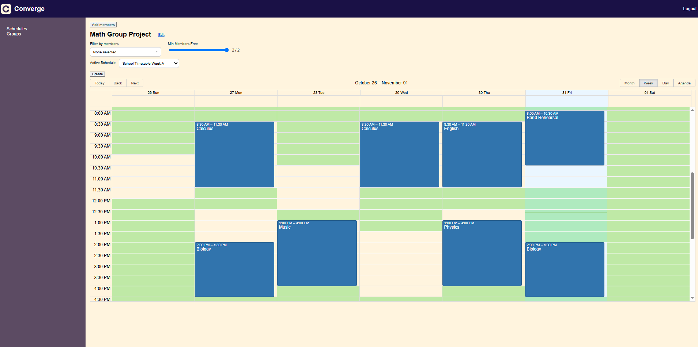
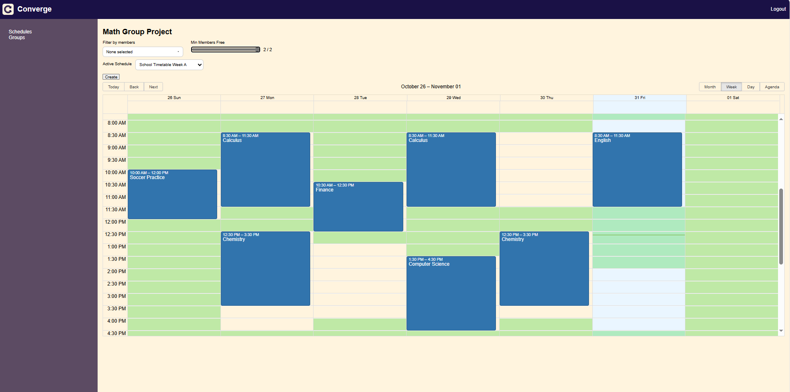

# Converge
Converge is a realtime group scheduler that enables users to easily identify shared availability across schedules.

## User A (Group Admin)

## User B (Group Member)

## Core Features
- **Realtime availability** (WebSockets + Redis): instant updates as people mark busy/free.
- **Group schedules & filtering**: highlight slots where ≥ _n_ members can meet.
- **Auth & roles**: JWT auth, group owners/moderators.
- **Multi-schedule support**: layer personal + group calendars.
- **API-first**: typed REST endpoints + WS channel for presence/availability.

> Roadmap: recurring events, calendar imports, mobile support, custom time logic, invite links.

## Tech Stack

| Layer      | Technologies (versions)                                | Why it’s here |
|----------- |--------------------------------------------------------|---------------|
| Frontend   | React + Vite, TypeScript, React Router, RTL/Vitest     | Fast DX, typed UI, SPA routing |
| Backend    | Django 5, Django REST Framework, Python 3.13           | Rapid APIs, admin, modern Python |
| Realtime   | Django Channels, WebSockets, Redis (channel layer)     | Low-latency availability updates |
| Database   | PostgreSQL 15                                          | Relational database |
| Auth       | JWT (access/refresh), CORS/CSRF hardening              | Simple stateless auth across SPA + API |
| Infra      | Docker Compose, Nginx                                  | Local/prod parity, static/WS proxy, zero-downtime reloads |